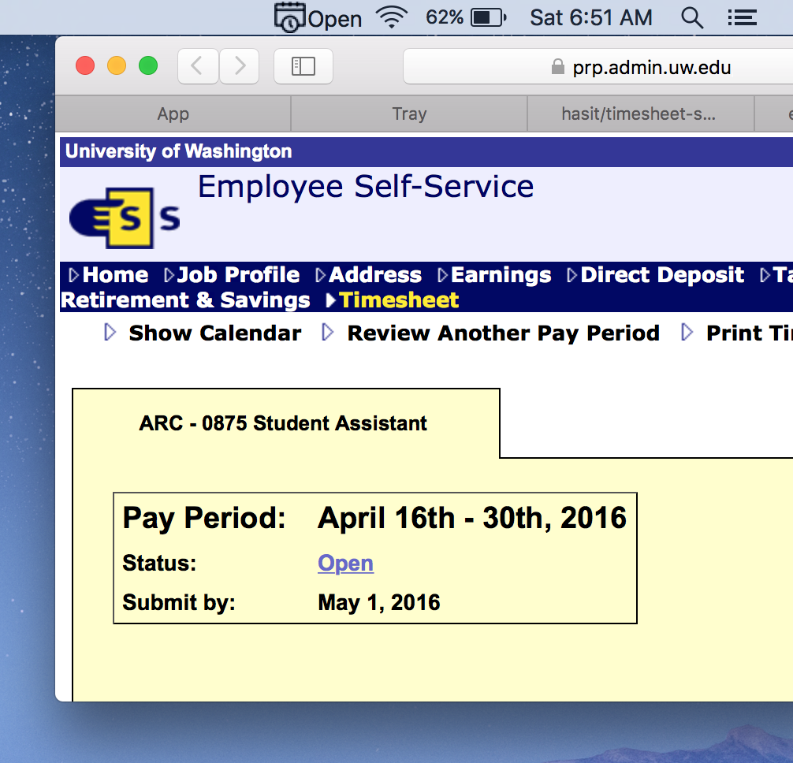

# timesheet-status

Check your ESS timesheet status with ease from your menubar.

If you are a student employee on any UW campus and check Employee Self-Service (ESS) at MyUW regularly to see if and when you'll be receiving that next fat paycheck, this is the right app for you.

As you can see from the screenshot, **timesheet-status** shows the correct status right in your menubar with a pretty little icon.

## Contribution

Following is a list of features I'd like to add going forward. If you happen to implement any of these (or more), send out a PR and I will be more than happy to merge the changes.

- [ ] Add 'Refresh' in contextMenu to manually refresh the status.
- [ ] Auto-refresh in default (say 10 minutes) internal.
- [ ] Add 'Preferences' window to set Auto-refresh interval.
- [ ] Add ability to see part timesheet statuses.

## Credit

- Icon made by [freepik](http://www.flaticon.com/authors/freepik) from [www.flaticon.com](www.flaticon.com).
- [Electron](http://electron.atom.io) for making the cross-platform app.
- [cheerio](https://github.com/cheeriojs/cheerio) for reading HTML.
